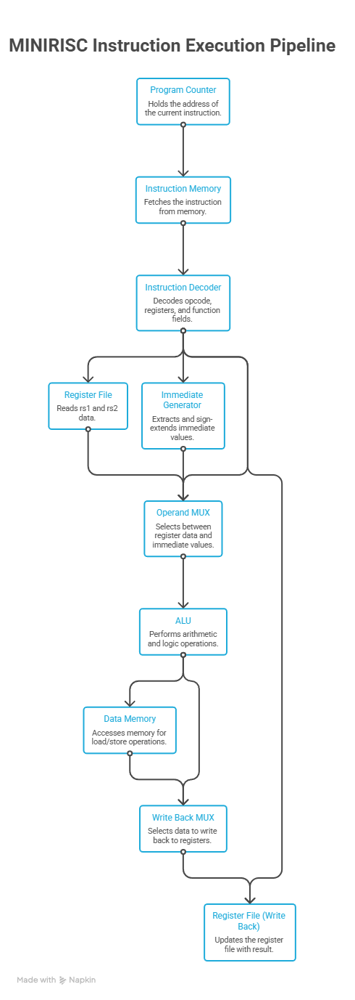
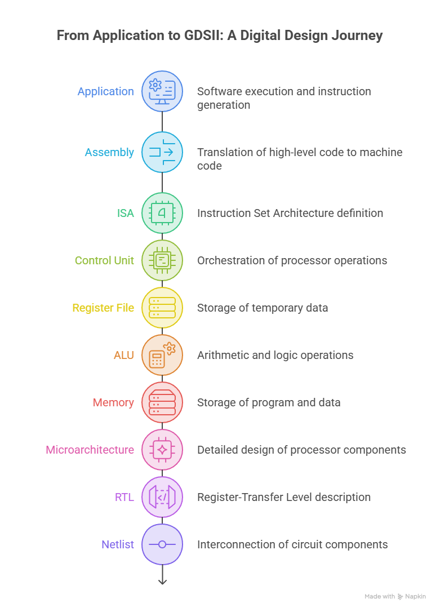

# MiniRISC

> **RTL-to-GDS implementation of an 8-bit Single-Cycle RISC Processor using SystemVerilog and the open-source ASIC design flow.**


---

## Overview

MiniRISC is an educational yet industry-oriented ASIC design project that implements an **8-bit Single-Cycle RISC Processor** completely from scratch.

The project follows the complete digital ASIC implementation flow—from processor architecture and RTL development to synthesis, static timing analysis, physical implementation, and final GDSII generation—using an open-source EDA ecosystem.

Unlike projects that stop after RTL simulation, MiniRISC documents the engineering concepts, implementation reports, and artifacts generated throughout the RTL-to-GDS flow.

---

# Processor Architecture

The processor consists of the following hardware modules:

- Program Counter (PC)
- Instruction Memory
- Instruction Decoder
- Control Unit
- Register File (8 × 8-bit)
- Immediate Generator
- ALU Operand Multiplexer
- Arithmetic Logic Unit (ALU)
- Data Memory
- Write-Back Multiplexer

<p align="center">

</p>

<p align="center">
<b>Figure 1.</b> MiniRISC Single-Cycle Datapath
</p>

---

# Project Goals

- Design a custom 8-bit RISC processor from scratch.
- Implement modular, parameterized SystemVerilog RTL.
- Verify functionality using self-checking testbenches.
- Understand logic synthesis and timing closure.
- Study each stage of the RTL-to-GDS implementation flow.
- Document the engineering concepts behind every stage.

---

# Processor Specifications

| Parameter | Value |
|------------|-------|
| Architecture | Single-Cycle RISC |
| Datapath Width | 8-bit |
| Instruction Width | 16-bit |
| Register File | 8 × 8-bit |
| RTL Language | SystemVerilog |
| Clock Constraint | 10 ns |
| Technology | SKY130 HD Standard Cell Library |

---

# Features

- Custom 8-bit Single-Cycle RISC ISA
- 16-bit fixed-width instruction format
- Modular SystemVerilog RTL
- Parameterized hardware modules
- Self-checking SystemVerilog testbenches
- Functional verification using GTKWave
- Static timing analysis using OpenSTA
- Complete RTL-to-GDS implementation flow
- Documentation of synthesis, timing, and physical design reports

---

# ASIC Design Flow

MiniRISC follows the standard digital ASIC implementation flow.

<p align="center">

</p>

<p align="center">
<b>Figure 2.</b> ASIC Design and Development Flow
</p>

The implementation stages include:

- Architecture
- RTL Design
- Functional Verification
- Logic Synthesis
- Static Timing Analysis (STA)
- Floorplanning
- Placement
- Clock Tree Synthesis (CTS)
- Routing
- GDSII Generation

> **Implementation Note**
>
> The RTL-to-GDS implementation was executed using the OpenROAD-based **Catalyzer educational flow**. This project focuses on understanding each implementation stage, analyzing the generated reports and metrics, and documenting how an RTL processor is transformed into a manufacturable GDSII layout. The physical implementation algorithms themselves were not developed as part of this project.

---

# RTL Toolchain

The processor was developed using the following open-source toolchain.

<p align="center">

</p>

<p align="center">
<b>Figure 3.</b> RTL Development and ASIC Toolchain
</p>

---

# Functional Verification

Functional verification was performed using self-checking SystemVerilog testbenches.

Verification included:

- Module-level verification
- Top-level CPU verification
- Instruction execution validation
- Register write-back verification
- Memory load/store verification
- GTKWave waveform debugging
- HEX-based memory initialization

---

# Top-Level CPU Waveform

The waveform below shows instruction fetch, decode, ALU execution, memory access, and register write-back during processor execution.

<p align="center">

</p>

<p align="center">
<b>Figure 4.</b> Top-Level CPU Functional Verification
</p>

---

# RTL-to-GDS Results

| Metric | Value |
|---------|------:|
| Technology | SKY130 HD |
| Synthesized Standard Cells | 135 |
| Clock Constraint | 10 ns |
| Worst Negative Slack (WNS) | 0 ns |
| Total Negative Slack (TNS) | 0 ns |
| Die Size | 95.32 × 95.32 μm |
| Die Area | 9085.9 μm² |
| Core Utilization | 26% |
| Routing Overflow | 0 |
| DRC Errors | 0 |

---

# Project Status

| Stage | Status |
|--------|--------|
| Processor Architecture | ✅ Complete |
| RTL Design | ✅ Complete |
| Functional Verification | ✅ Complete |
| Logic Synthesis | ✅ Complete |
| Static Timing Analysis | ✅ Complete |
| Floorplanning | ✅ Complete |
| Placement | ✅ Complete |
| Clock Tree Synthesis | ✅ Complete |
| Routing | ✅ Complete |
| GDSII Generation | ✅ Complete |
| Documentation | 🚧 In Progress |

---

# Repository Structure

```text
MiniRISC/
│
├── docs/
│   ├── architecture/
│   ├── diagrams/
│   ├── metrics.md
│   ├── interview_notes.md
│   └── lessons_learned.md
│
├── rtl/
├── tb/
├── pkg/
├── constraints/
├── program/
├── reports/
├── screenshots/
├── scripts/
├── README.md
└── LICENSE
```

---

# Documentation

Detailed documentation is available inside the `docs/` directory.

| Document | Description |
|----------|-------------|
| Project Overview | Design goals and motivation |
| Processor Architecture | Datapath and module descriptions |
| Functional Verification | Testbench methodology and waveforms |
| Logic Synthesis | RTL synthesis and reports |
| Static Timing Analysis | Timing constraints and timing reports |
| Floorplanning | Core planning and utilization |
| Placement | Standard-cell placement |
| Clock Tree Synthesis | Clock distribution |
| Routing | Signal routing |
| GDSII Generation | Final layout generation |
| Metrics | Summary of implementation metrics |
| Interview Notes | Common interview questions and explanations |
| Lessons Learned | Key engineering takeaways |

---

# Tools Used

| Category | Tool |
|----------|------|
| RTL Design | SystemVerilog |
| Simulation | Icarus Verilog |
| Waveform Debugging | GTKWave |
| Logic Synthesis | Yosys |
| Static Timing Analysis | OpenSTA |
| Physical Design | OpenROAD (Catalyzer Flow) |
| Layout Verification | Magic |
| LVS | Netgen |
| Technology | SKY130 Open PDK |

---

# Learning Outcomes

Through this project, I gained practical exposure to:

- Processor architecture and datapath design
- RTL development using SystemVerilog
- Functional verification using self-checking testbenches
- Logic synthesis using Yosys
- Static Timing Analysis (STA) using OpenSTA
- Reading synthesis, timing, and physical implementation reports
- Understanding floorplanning, placement, CTS, routing, and GDSII generation
- End-to-end ASIC implementation using an open-source digital design flow

---

# Future Improvements

- Multi-cycle architecture
- Five-stage pipelined processor
- Hazard detection and forwarding
- Branch prediction
- Interrupt support
- Cache integration
- SystemVerilog Assertions (SVA)
- Formal verification
- Continuous Integration (CI) regression flow

---

# Acknowledgements

This project builds upon the open-source digital ASIC ecosystem, including:

- SystemVerilog
- Icarus Verilog
- GTKWave
- Yosys
- OpenSTA
- OpenROAD
- Magic VLSI
- Netgen
- SKY130 Open PDK
- Catalyzer RTL-to-GDS educational flow

Special thanks to the developers and maintainers of these open-source tools, which make ASIC education and experimentation accessible to students and researchers worldwide.
